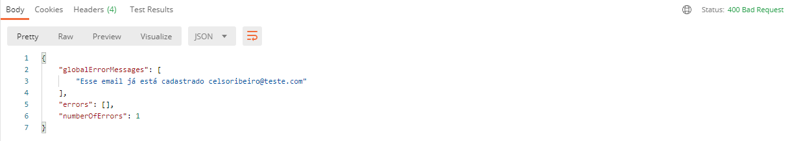
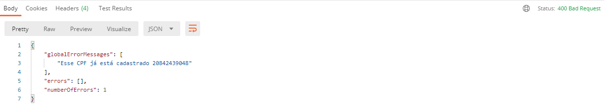

# Orange Talents

Programa de capacitação para Devs Zup Innovation.

## Descrição

Esse documento contém a implementação do desafio Orange Talents e uma explicação detalhada dessa implementação.

## Tecnologias utilizadas

* Linguagem Java
* Framework Spring
* Spring Boot
* Spring MVC
* Spring DevTools
* Spring Validation
* Hibernate como implementação da JPA para ORM
* Banco de dados MySQL
* Eclipse IDE
* Postman

## Desafio proposto

Você está fazendo uma API REST que precisa suportar o processo de abertura de nova conta no banco. O primeiro passo desse fluxo é cadastrar os dados pessoais de uma pessoa. Precisamos de apenas algumas informações obrigatórias:

* Nome
* E-mail
* CPF
* Data de nascimento

Caso os dados estejam corretos, é necessário gravar essas informações no banco de dados relacional e retornar o status adequado para a aplicação cliente, que pode ser uma página web ou um aplicativo mobile.

Você deve fazer com que sua API devolva a resposta adequada para o caso de falha de validação.

**Item bônus:** Se ficou fácil, considere que você também precisa explicar como faria para proteger a aplicação de e-mail e CPF duplicados.

## Mãos a Obra

### Criando o projeto

Utilizei o site do Spring Initializer <https://start.spring.io/> para criar o projeto e suas dependências conforme exemplo abaixo:


Feito isso, basta clicar no botão Generate e o próprio site irá gerar o pacote para importação do projeto, ele será enviado compactado via download, então devemos antes extrair e importar na IDE.

* Lembrando que ao importar, devemos importar como um projeto Maven, pois neste caso o pacote do Spring Boot é um projeto Maven.

Após o “import”, uma série de downloads será inicializado podendo demorar um pouco dependendo da velocidade da sua internet.

### Configurando a conexão com o banco de dados

Para que os dados da API possam ser persistidos no banco é necessário além da instalação do MySQL a configuração do JPA\Hibernate com as informações de acesso a esse banco de dados. Essa configuração é feita através do arquivo *src/main/resources/application.properties*.

```json
spring.datasource.url=jdbc:mysql://127.0.0.1:3306/apibank?createDatabaseIfNotExist=true&serverTimezone=UTC
spring.datasource.username="seu usuario"
spring.datasource.password="sua senha"
spring.jpa.generate-ddl=true
spring.jpa.hibernate.ddl-auto=update
spring.jpa.show-sql=true
spring.jpa.properties.hibernate.dialect=org.hibernate.dialect.MySQL57Dialect
```

### Implementando o cadastro de Clientes

#### Definição das classes

A primeira classe que criei no projeto foi o controller *CadastroClientesController*, aqui utilizo a abordagem de iniciar o desenvolvimento pelas bordas mais externas da aplicação onde ocorre a entrada de dados assim, consigo executar o mais rápido possível o código da aplicação e mais rápido consigo identificar possíveis erros. No controller criei o método `create()` e marquei com a anotação `@PostMapping` que sinaliza que este método será responsável por tratar requisições do tipo *POST*. Também faço uso da interface do `EntityManager` atráves da **Injeção de dependência** `@Autowired` para realizar a persistência dos dados após serem validados. Ocorrendo tudo certo, é retornado para o consumidor da API a representação de um objeto da classe de domínio *Cliente* no corpo da requisição com código de resposta `HTTP Status 200 (Ok)` e caso os dados não passem pela validação é retornado um código de resposta `HTTP Status 400 (Bad Request)` com os dados sobre o erro no corpo da requisição. Utilizo a classe *ResponseEntity* para está tarefa.

Classe *CadastroClientesController*

```java
@RestController
@RequestMapping("/clientes")
public class CadastroClientesController {

@Autowired
private EntityManager manager;

@PostMapping
@Transactional
public ResponseEntity<Cliente> create(@RequestBody @Valid NovoClienteRequest request) {
  Cliente cliente = request.toModel();
  manager.persist(cliente);
  return ResponseEntity.ok(cliente);
  }
}
```

A próxima classe criada foi a *NovoClienteRequest* para trabalhar nas validações necessárias para proteger as bordas da aplicação. Nessa classe também existe o método `toModel()` que utilizo para converter o objeto que representa uma requisição, depois dos dados validados, em um objeto do modelo de domínio para persistência no banco de dados. Nesta classe também utilizo as validações presentes na **Bean Validadion** que são requisitos para o projeto através das anotações: `@NotBlank`, `@Email`, `@CPF`, `@NotNull` e `@Past`

Classe *NovoClienteRequest*

```java
public class NovoClienteRequest {

@NotBlank
private String nome;

@NotBlank
@Email
private String email;

@NotBlank
@CPF
private String cpf;

@NotNull
@Past
private LocalDate dataNascimento;

public NovoClienteRequest(@NotBlank String nome, @NotBlank @Email String email, @NotBlank @CPF String cpf,
  @NotNull @Past LocalDate dataNascimento) {
  this.nome = nome;
  this.email = email;
  this.cpf = cpf;
  this.dataNascimento = dataNascimento;
  }

  public Cliente toModel() {
    return new Cliente(this.nome, this.email, this.cpf, this.dataNascimento);
  }
}
```

E por último a classe *Cliente* que é a classe de objeto de domínio que realmente possui os atributos que representam os dados que precisam ser armazenados no banco de dados.

Classe *Cliente*

```java
@Entity
public class Cliente {

@Id
@GeneratedValue(strategy = GenerationType.IDENTITY)
private Long id;

private @NotBlank String nome;
private @NotBlank @Email String email;
private @NotBlank @CPF String cpf;

@NotNull
@Past
private LocalDate dataNascimento;

  public Cliente(@NotBlank String nome, @NotBlank @Email String email, @NotBlank @CPF String cpf,
      @NotNull @Past LocalDate dataNascimento) {
    this.nome = nome;
    this.email = email;
    this.cpf = cpf;
    this.dataNascimento = dataNascimento;
  }

  public Long getId() {
    return id;
  }

  public String getNome() {
    return nome;
  }

  public String getEmail() {
    return email;
  }

  public String getCpf() {
    return cpf;
  }

  public LocalDate getDataNascimento() {
    return dataNascimento;
  }

}
```

#### Testando a API

Para realizar os testes estou utilizando o *Postman* passando os seguintes *JSON*:

* Sucesso

```json
{
  "nome":"Celso Ribeiro",
  "email": "celsoribeiro@teste.com",
  "cpf": "20842439048",
  "dataNascimento": "1990-12-25"
}
```

Resultado:


* Falha

```json
{
  "nome":"",
  "email": "",
  "cpf": "",
  "dataNascimento": ""
}
```

Resultado:


No próximo tópico explico como fiz para manipular as mensagens de erro.

### Manipulando exceções

É muito ruim para o consumidor da API receber uma mensagem de erro não tratada com a stacktrace que só interessa ao desenvolvedor da aplicação. Tudo que o consumidor necessita saber de forma sucinta é se o erro retornado está relacionado com os dados enviados por ele se temos um erro interno da aplicação e é por isso que manipular os erros retornados pela API se faz necessário.

#### Definição das classes

A primeira classe que criei para atender a esse objetivo foi a classe *FieldErrorOutputDto*. Nela defini os atributos das mensagens de erro que vamos manipular na resposta da API.

Classe *FieldErrorOutputDto*

```java
public class FieldErrorOutputDto {

private String field;
private String message;

  FieldErrorOutputDto() {
  }

  public FieldErrorOutputDto(String field, String message) {
    this.field = field;
    this.message = message;
  }

  public String getField() {
    return field;
  }

  public String getMessage() {
    return message;
  }
} 
```

A próxima classe foi a *ValidationErrorsOutputDto* que é a classe utilizada na resposta quando houver uma mensagem de erro a ser enviada para o consumidor da API utilizando a classe *FieldErrorOutputDto* que define os atributos. Nessa classe também temos o método `getNumberOfErrors()` que informa quantos erros ocorreram ao consumidor da API.

```java
public class ValidationErrorsOutputDto {

private List<String> globalErrorMessages = new ArrayList<>();
private List<FieldErrorOutputDto> fieldErrors = new ArrayList<>();

  public void addError(String message) {
    globalErrorMessages.add(message);
  }

  public void addFieldError(String field, String message) {
    FieldErrorOutputDto fieldError = new FieldErrorOutputDto(field, message);
    fieldErrors.add(fieldError);
  }

  public List<String> getGlobalErrorMessages() {
    return globalErrorMessages;
  }

  public List<FieldErrorOutputDto> getErrors() {
    return fieldErrors;
  }

  public int getNumberOfErrors() {
    return this.globalErrorMessages.size() + this.fieldErrors.size();
  }
} 
```

Por último temos a classe *ValidationErrorHandler* que é a classe responsável por realizar a captura dos erros e a sua manipulação para o consumidor da API. Essa classe é anotada com `@RestControllerAdvice` que é uma união das anotações `@ControllerAdvice + @ResponseBody` e que auxilia na manipulação de exceções `@ExceptionHandler`. Nesta implementação sempre que um exceção for lançada ex: `MethodArgumentNotValidException.class` será interceptada pela classe *ValidationErrorHandler* de forma global e um código de resposta `HTTP Status 400 (Bad Request)` será retornado junto com a mensagem de erro no corpo da requisição mensagem essa, que é gerada através do método `buildValidationErrors()`.

```java
@RestControllerAdvice
public class ValidationErrorHandler {

@Autowired
private MessageSource messageSource;


  @ResponseStatus(HttpStatus.BAD_REQUEST)
  @ExceptionHandler(MethodArgumentNotValidException.class)
  public ValidationErrorsOutputDto handleValidationError(MethodArgumentNotValidException exception) {

    List<ObjectError> globalErrors = exception.getBindingResult().getGlobalErrors();
    List<FieldError> fieldErrors = exception.getBindingResult().getFieldErrors();

    return buildValidationErrors(globalErrors, fieldErrors);
  }

  @ResponseStatus(HttpStatus.BAD_REQUEST)
  @ExceptionHandler(BindException.class)
  public ValidationErrorsOutputDto handleValidationError(BindException exception) {

    List<ObjectError> globalErrors = exception.getBindingResult().getGlobalErrors();
    List<FieldError> fieldErrors = exception.getBindingResult().getFieldErrors();

    return buildValidationErrors(globalErrors, fieldErrors);
  }

  private ValidationErrorsOutputDto buildValidationErrors(List<ObjectError> globalErrors,
      List<FieldError> fieldErrors) {
    ValidationErrorsOutputDto validationErrors = new ValidationErrorsOutputDto();

    globalErrors.forEach(error -> validationErrors.addError(getErrorMessage(error)));

    fieldErrors.forEach(error -> {
      String errorMessage = getErrorMessage(error);
      validationErrors.addFieldError(error.getField(), errorMessage);
    });
    return validationErrors;
  }

  private String getErrorMessage(ObjectError error) {
    return messageSource.getMessage(error, LocaleContextHolder.getLocale());
  }
}
```

### Bônus: Validação de duplicidade para Email e CPF

Como item bônus implementei também uma validação adicional para Email e CPF não permitindo a inserão em duplicidade desses dois atributos no banco de dados.

#### Definição das classes

A primeira implementação foi da interface *ClienteRespository*. Implementei essa interface para utilizar as vantagens de estende-la através de herança usando a classe *JpaRepository* na definição de métodos customizados para a pesquisa por atributos especificos da entidade *Cliente* no banco de dados como Email e CPF. Os métodos `findByCpf() e findByEmail()` ambos retornam um objeto do tipo *Optional* e dentro desse objeto pode conter ou não um objeto da classe *Cliente* para que possamos manipular.

Interface *ClienteRespository*

```java
public interface ClienteRepository extends JpaRepository<Cliente, Long> {

  Optional<Cliente> findByCpf(String cpf);

  Optional<Cliente> findByEmail(String email);
}
```

As próximas classes implementadas foram as classes *CpfUnicoValidator* e *EmailUnicoValidator* ambas são classes de validação customizadas e implementam a interface *Validator* do *springframework.Validator* e seus métodos de implementação obrigatória `supports()` e `validate()`. Esses métodos respectivamente, são responsáveis por validar se essa classe validadora pode avaliar instâncias da classe fornecida e validar o objeto dado e em caso de erros de validação, registra os objetos com erros.

Nessa classe também temos injetado a interface *ClienteRespository* e usamos os métodos customizados de pesquisa para validar se ou Email e\ou CPF já estão cadastrados no banco de dados.

Essas classes também são anotadas com o `@Component` que as identificam como classes controladas pelo *Spring Framework* e gerenciadas em seu ciclo de vida.

Classe *CpfUnicoValidator*

```java
@Component
public class CpfUnicoValidator implements Validator {

@Autowired
private ClienteRepository clienteRepository;

  @Override
  public boolean supports(Class<?> clazz) {

    return NovoClienteRequest.class.isAssignableFrom(clazz);
  }

  @Override
  public void validate(Object target, Errors errors) {
    if (errors.hasErrors()) {
      return;
    }

  NovoClienteRequest request = (NovoClienteRequest) target;
  Optional<Cliente> possivelClienteCpfDuplicado = clienteRepository.findByCpf(request.getCpf());

    if (possivelClienteCpfDuplicado.isPresent()) {
      errors.reject("cpf", "Esse CPF já está cadastrado " + request.getCpf());
    }

  }
}
```

Classe *EmailUnicoValidator*

```java
@Component
public class EmailUnicoValidator implements Validator {

@Autowired
private ClienteRepository clienteRepository;

  @Override
  public boolean supports(Class<?> clazz) {
    return NovoClienteRequest.class.isAssignableFrom(clazz);
  }

  @Override
  public void validate(Object target, Errors errors) {
    if (errors.hasErrors()) {
      return;
    }

    NovoClienteRequest request = (NovoClienteRequest) target;
    Optional<Cliente> possivelClienteEmailDuplicado = clienteRepository.findByEmail(request.getEmail());

    if (possivelClienteEmailDuplicado.isPresent()) {
      errors.reject("email", "Esse email já está cadastrado " + request.getEmail());
    }
  }

}
```

Para que essa validação ocorra foi necessário adicionar um novo método na controller *CadastroClientesController* e injetar novos atributos nessa classe.

O método `init` anotado com `@InitBinder` vai validar uma requisição de entrada usando as classes de validação customizadas *EmailUnicoValidator* e *CpfUnicoValidator*.

Classe *CadastroClientesController*

```java
@RestController
@RequestMapping("/clientes")
public class CadastroClientesController {

  @Autowired
  private EntityManager manager;

  @Autowired
  private EmailUnicoValidator emailUnicoValidator;

  @Autowired
  private CpfUnicoValidator cpfUnicoValidator;

  @InitBinder
  public void init(WebDataBinder binder) {
    binder.addValidators(emailUnicoValidator, cpfUnicoValidator);
  }

  @PostMapping
  @Transactional
  public ResponseEntity<Cliente> create(@RequestBody @Valid NovoClienteRequest request) {
    Cliente cliente = request.toModel();
    manager.persist(cliente);
    return ResponseEntity.ok(cliente);
  }
}
```

#### Testando a API

Estou usando os seguintes *JSON* de exemplo:

* Tentando cadastrar 2x o mesmo cliente.

```json
{
  "nome":"Celso Ribeiro",
  "email": "celsoribeiro@teste.com",
  "cpf": "20842439048",
  "dataNascimento": "1990-12-25"
}
```

Resultado:



* Tentando cadastrar um cliente com CPF já cadastrado.

```json
{
  "nome":"Celso Antunes",
  "email": "celsoantunes@teste.com",
  "cpf": "20842439048",
  "dataNascimento": "1980-10-14"
}
```

Resultado:



## Conclusão

Esse projeto e artigo foram estremamente prazerosos de serem desenvolvidos. Muitos desafios foram superados como o item bônus de validações customizadas e o tratamento de exceções.

O código completo deste desafio está no meu repositório no GitHub.
<https://github.com/celsofilho82/orange-talents>
