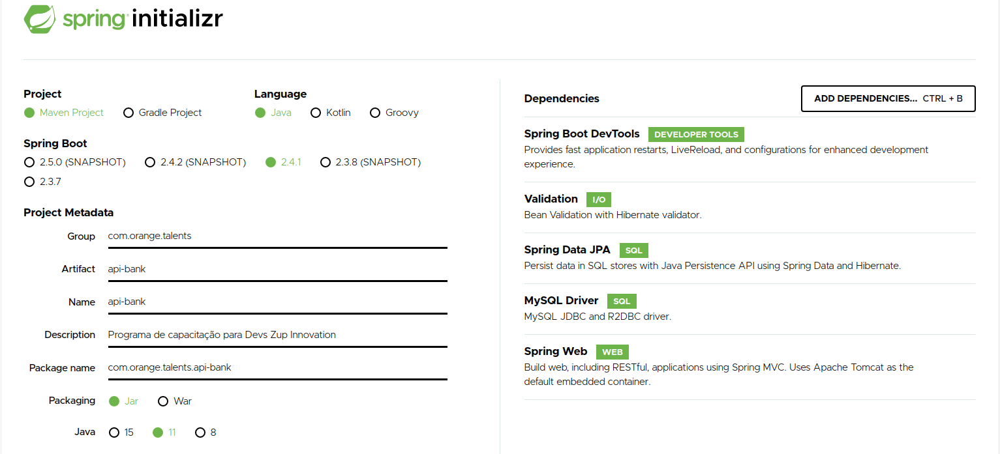
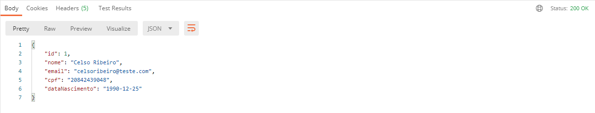
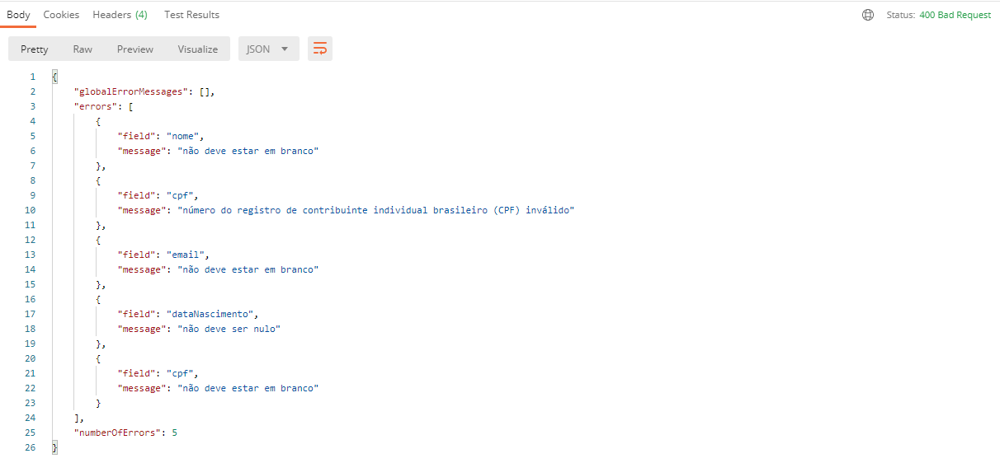

# Orange Talents

Programa de capacitação para Devs Zup Innovation.

## Descrição

Esse documento contém a implementação do desafio Orange Talents e uma explicação detalhada dessa implementação.

## Tecnologias utilizadas

* Linguagem Java
* Framework Spring
* Spring Boot
* Spring MVC
* Spring DevTools
* Spring Validation
* Hibernate como implementação da JPA para ORM
* Banco de dados MySQL
* Eclipse IDE
* Postman

## Desafio proposto

Você está fazendo uma API REST que precisa suportar o processo de abertura de nova conta no banco. O primeiro passo desse fluxo é cadastrar os dados pessoais de uma pessoa. Precisamos de apenas algumas informações obrigatórias:

* Nome
* E-mail
* CPF
* Data de nascimento

Caso os dados estejam corretos, é necessário gravar essas informações no banco de dados relacional e retornar o status adequado para a aplicação cliente, que pode ser uma página web ou um aplicativo mobile.

Você deve fazer com que sua API devolva a resposta adequada para o caso de falha de validação.

**Item bônus:** Se ficou fácil, considere que você também precisa explicar como faria para proteger a aplicação de e-mail e CPF duplicados.

## Mãos a Obra

### Criando o projeto

Utilizei o site do Spring Initializer <https://start.spring.io/> para criar o projeto e suas dependências conforme exemplo abaixo:



Feito isso, basta clicar no botão Generate e o próprio site irá gerar o pacote para importação do projeto, ele será enviado compactado via download, então devemos antes extrair e importar na IDE.

* Lembrando que ao importar, devemos importar como um projeto Maven, pois neste caso o pacote do Spring Boot é um projeto Maven.

Após o “import”, uma série de downloads será inicializado podendo demorar um pouco dependendo da velocidade da sua internet.

### Configurando a conexão com o banco de dados

Para que os dados da API possam ser persistidos no banco é necessário além da instalação do MySQL a configuração do JPA\Hibernate com as informações de acesso a esse banco de dados. Essa configuração é feita através do arquivo *src/main/resources/application.properties*.

```
spring.datasource.url=jdbc:mysql://127.0.0.1:3306/apibank?createDatabaseIfNotExist=true&serverTimezone=UTC
spring.datasource.username="seu usuario"
spring.datasource.password="sua senha"
spring.jpa.generate-ddl=true
spring.jpa.hibernate.ddl-auto=update
spring.jpa.show-sql=true
spring.jpa.properties.hibernate.dialect=org.hibernate.dialect.MySQL57Dialect
```

### Implementando o cadastro de Clientes

#### Definição das classes

A primeira classe que criei no projeto é o controller *CadastroClientesController*, aqui eu utilizo a abordagem de iniciar o desenvolvimento pelas bordas mais externas da aplicação onde ocorre a entrada de dados assim, consigo executar o mais rápido possível o código da aplicação e mais rápido consigo identificar possíveis erros. No controller também faço uso da interface do `EntityManager` atráves da **Injeção de dependência** `@Autowired` para realizar a persistência dos dados após serem validados. Ocorrendo tudo certo, é retornado para o consumidor da API a representação de um objeto da classe *Cliente* no corpo da requisição e o código de resposta `HTTP Status 200 (Ok)` e caso os dados não passem pela validação é retornado para o consumidor da API um código de resposta `HTTP Status 400 (Bad Request)` com os dados sobre o erro no corpo da requisição. Utilizo a classe *ResponseEntity* para está tarefa.

Código da classe *CadastroClientesController*

```
@RestController
@RequestMapping("/clientes")
public class CadastroClientesController {

@Autowired
private EntityManager manager;

@PostMapping
@Transactional
public ResponseEntity<Cliente> create(@RequestBody @Valid NovoClienteRequest request) {
  Cliente cliente = request.toModel();
  manager.persist(cliente);
  return ResponseEntity.ok(cliente);
  }
}
```

Criei a classe *NovoClienteRequest* para trabalhar nas validações necessárias para proteger as bordas da aplicação. Nessa classe também existe o método `toModel()` que utilizo para converter o objeto que representa uma requisição, depois de validados os dados, em um objeto do modelo de domínio para persistência no banco de dados. Nesta classe também utilizo as validações presentes na **Bean Validadion** que são requisitos para o projeto através das anotações: `@NotBlank`, `@Email`, `@CPF`, `@NotNull` e `@Past`

Código da classe *NovoClienteRequest*

```
public class NovoClienteRequest {

@NotBlank
private String nome;

@NotBlank
@Email
private String email;

@NotBlank
@CPF
private String cpf;

@NotNull
@Past
private LocalDate dataNascimento;

public NovoClienteRequest(@NotBlank String nome, @NotBlank @Email String email, @NotBlank @CPF String cpf,
  @NotNull @Past LocalDate dataNascimento) {
  this.nome = nome;
  this.email = email;
  this.cpf = cpf;
  this.dataNascimento = dataNascimento;
  }

  public Cliente toModel() {
    return new Cliente(this.nome, this.email, this.cpf, this.dataNascimento);
  }
}
```

A próxima é a classe *Cliente* que é a nossa classe de objeto de domínio que realmente possui os atributos que representam os dados que precisam ser armazenados no banco de dados.

Código da classe *Cliente*

```
@Entity
public class Cliente {

@Id
@GeneratedValue(strategy = GenerationType.IDENTITY)
private Long id;

private @NotBlank String nome;
private @NotBlank @Email String email;
private @NotBlank @CPF String cpf;

@NotNull
@Past
private LocalDate dataNascimento;

  public Cliente(@NotBlank String nome, @NotBlank @Email String email, @NotBlank @CPF String cpf,
      @NotNull @Past LocalDate dataNascimento) {
    this.nome = nome;
    this.email = email;
    this.cpf = cpf;
    this.dataNascimento = dataNascimento;
  }

  public Long getId() {
    return id;
  }

  public String getNome() {
    return nome;
  }

  public String getEmail() {
    return email;
  }

  public String getCpf() {
    return cpf;
  }

  public LocalDate getDataNascimento() {
    return dataNascimento;
  }

}
```

#### Testando a API

Para realizar os testes na API estou utilizando o *Postman* passando os seguintes *JSON* como modelo:

* Sucesso
```
{
  "nome":"Celso Ribeiro",
  "email": "celsoribeiro@teste.com",
  "cpf": "20842439048",
  "dataNascimento": "1990-12-25"
}
```
Retorno



* Falha
```
{
  "nome":"",
  "email": "",
  "cpf": "",
  "dataNascimento": ""
}
```
Retorno



No próximo tópico explico como fiz para manipular as mensagens de erro.
